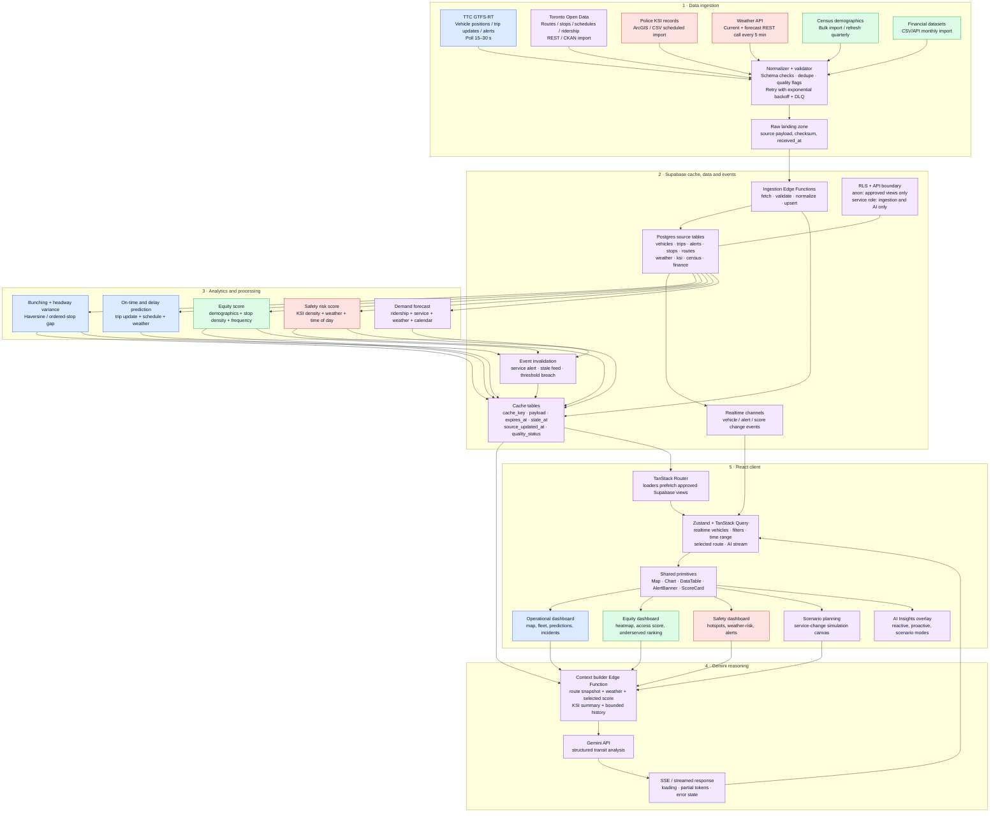
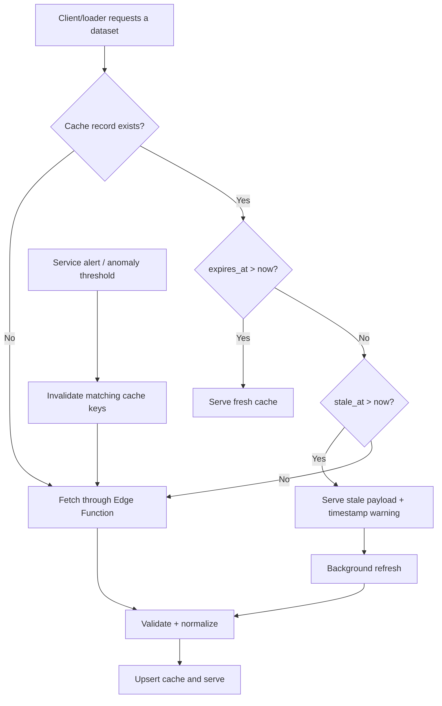

# TransitLens — Target System Architecture

## Purpose and scope

This is the target implementation architecture for TransitLens: a real-time TTC decision-support platform with three traceable intelligence pillars.

| Pillar | Colour | Decision supported |
|---|---|---|
| Operational Intelligence | Blue | Service control, delay, bunching, schedule adherence |
| Equity Intelligence | Green | Service access, underserved-area and affordability decisions |
| Safety Intelligence | Red | Collision risk, weather-risk and hotspot mitigation |
| Shared platform controls | Purple | Cache, security, orchestration, AI, observability |

The current repository already contains the React/TanStack Router/Supabase foundations, vehicle updates, bunching logic, data pages and a Gemini client. The diagram describes the production target: in particular, move Gemini invocation from the browser to a Supabase Edge Function, retain source API keys only server-side, and make cache state explicit.

## Layered architecture

### Data contracts and refresh rules

* Every ingestion record carries `source`, `source_updated_at`, `received_at`, `quality_status`, and a deterministic source key. Validation rejects malformed coordinates, invalid timestamps, duplicate entity/version pairs, and out-of-range measures; failures are retried with jittered exponential backoff and then held in a dead-letter table for review.
* Cache reads are stale-while-revalidate. A usable expired payload renders with **“Data may be stale · updated {timestamp}”**; a hard failure never blanks the dashboard if a last-known-good payload is available.
* Route loaders prefetch page-specific cache views. Real-time vehicle and alert subscriptions patch global client state without a full route reload. Maps and charts share route/time/filter state; a map click changes the side panel, and a filter change invalidates only dependent queries.
* Gemini is asynchronous in all modes. The overlay preserves the dashboard beneath it, supports cancellation, renders partial streamed content, and never gates route navigation or operational alerts.

## Caching decision tree

## Component responsibility matrix

| Component | Layer | Pillar | Inputs | Outputs / responsibility |
|---|---|---|---|---|
| GTFS-RT poller | Ingestion | Operational | Vehicle, trip, alert feeds | Normalized live events every 15–30 s |
| Open Data importer | Ingestion | Shared | TTC/Toronto REST, CKAN, static GTFS | Routes, stops, schedules, ridership snapshots |
| KSI importer | Ingestion | Safety | Police KSI ArcGIS/CSV | Geocoded collision history and quality flags |
| Weather adapter | Ingestion | Safety | Current/forecast API | Current condition and forecast risk factors |
| Census/finance imports | Ingestion | Equity | Bulk files/APIs | Stable demographic and financial dimensions |
| Validation + DLQ | Ingestion | Shared | Raw payloads | Accepted records, retry jobs, reviewable failures |
| Edge ingestion functions | Cache/data | Shared | Validated source records | Idempotent upserts, cache write and event emit |
| Supabase source tables | Cache/data | Shared | Normalized entities | Durable, queryable source of truth |
| Cache tables/views | Cache/data | Shared | Tables and analytic outputs | TTL-aware payloads with freshness metadata |
| Realtime publications | Cache/data | Shared | Vehicle, alert, score changes | Narrow client updates over subscriptions |
| RLS and approved views | Cache/data | Shared | JWT role / user scope | Least-privilege client access; no secret access |
| Bunching/headway engine | Analytics | Operational | Vehicle positions, route geometry, schedules | Bunching state, headway variance, alert event |
| On-time/delay model | Analytics | Operational | Trip updates, schedule, weather | On-time score and near-term delay estimate |
| Equity scorer | Analytics | Equity | Census, stop density, frequency, fare/cost data | Zone/route equity score and factors |
| Safety scorer | Analytics | Safety | KSI, weather, time, disruption context | Risk score, hotspot geometry, threshold event |
| Demand forecaster | Analytics | Shared | Ridership, service, weather, calendar | Forecast series and confidence band |
| Context builder | AI | Shared | Selected route plus bounded operational/equity/safety facts | Token-budgeted, cited prompt context |
| Gemini gateway | AI | Shared | Context and user/scenario prompt | Streamed, safe natural-language analysis |
| Router loaders | Client | Shared | Route and query parameters | Prefetched approved cache data |
| Client state | Client | Shared | Realtime events, loader data, interactions | Scoped filters, selected route, AI stream state |
| Shared UI primitives | Client | Shared | View models | Accessible map/chart/table/alert/score display |
| Pillar dashboards | Client | Operational / Equity / Safety | Pillar-specific cache views | Actionable operator, planner and safety views |

## Caching strategy reference

| Data source | Cache table / view | TTL | Invalidation trigger | Pillar |
|---|---|---:|---|---|
| GTFS-RT vehicle positions | `cache_vehicle_positions` | 15 s | New feed version; vehicle stale >90 s | Operational |
| GTFS-RT trip updates | `cache_trip_updates` | 30 s | New feed version; trip status change | Operational |
| GTFS-RT service alerts | `cache_service_alerts` | 30 s | Alert created, updated or removed | Operational |
| Bus bunching scores | `cache_bunching_scores` | 5 min | Pair enters/exits threshold; alert change | Operational |
| Weather current conditions | `cache_weather_current` | 5 min | Provider update; severe-weather threshold | Safety |
| Weather forecast | `cache_weather_forecast` | 15 min | Forecast issue/version change | Safety |
| Safety risk / hotspot layer | `cache_safety_risk` | 15 min | Weather threshold; KSI refresh; risk threshold | Safety |
| GTFS static / Toronto routes and stops | `cache_network_reference` | 24 h | Static feed version / scheduled import | Shared |
| Ridership and schedule aggregates | `cache_service_metrics` | 1 h | ETL completion; source revision | Operational |
| Census dimensions | `cache_census_profile` | 24 h | Census release/import revision | Equity |
| KSI historical aggregates | `cache_ksi_history` | 24 h | KSI import completion | Safety |
| Equity scores | `cache_equity_scores` | 1 h | Census/frequency/stop-density changes; score threshold | Equity |
| Financial summaries | `cache_finance_summary` | 24 h | Monthly close/import revision | Equity |
| Gemini insight response | `cache_ai_insights` | 10 min | Context fingerprint changes or user refresh | Shared |

## Processing definitions

| Measure | Definition | Output |
|---|---|---|
| Bunching | Same route/direction vehicles are ordered by projected route position; flag when consecutive vehicles are within 200 m or the headway falls below 50% of scheduled headway. | `route_id`, vehicle pair, distance, headway, severity |
| Headway variance | Variance of observed consecutive headways against scheduled headway over a rolling 15-minute window. | Route-level reliability index |
| On-time performance | Share of sampled trips whose deviation is within the TTC-defined tolerance; preserve late/early separately. | `otp_pct`, sample count, deviation distribution |
| Equity score | Normalize and weight `0.35 × need` + `0.30 × service gap` + `0.20 × accessibility barrier` + `0.15 × affordability burden`. Weights must be configurable and versioned. | 0–100 score, factor breakdown, confidence |
| Safety risk | `0.45 × normalized KSI density` + `0.30 × weather modifier` + `0.15 × time-of-day exposure` + `0.10 × disruption modifier`. | 0–100 risk, contributing factors, geometry |
| Demand forecast | Feature set: historic ridership, scheduled frequency, current delays, weather, weekday/holiday, events; output a 24-hour interval forecast. | timestamp, p50, p10, p90, model version |

## End-to-end flows

### 1. Bus bunching reaches the operator dashboard

1. The GTFS-RT poller retrieves vehicle positions every 15–30 seconds. The ingestion function validates the feed, upserts `vehicles`, writes `cache_vehicle_positions`, and publishes the changed vehicle IDs.
2. The bunching engine orders live vehicles by route/direction and projected route position. It computes Haversine distance and observed headway; a vehicle pair under the configured threshold writes `cache_bunching_scores` and raises a threshold event.
3. The event invalidates the affected route cache and publishes a Realtime update. The subscribed client merges only changed vehicles and scores into global state; the map paints the amber alert without a page reload.
4. The operational panel updates the selected route’s headway card, alert banner and delay chart. If the operator opens “Explain”, the client sends only the selected route snapshot to the context builder; the AI response streams into an overlay and cannot block the alert.

### 2. A planner asks Gemini about equity gaps on a route

1. The Equity route loader prefetches the route, stop, service-frequency, census and cached equity-score views. The planner selects Route 29 and asks the question.
2. The client sends the question, route ID, filter scope and UI context to an authenticated Edge Function; it does not send a Gemini credential or construct a raw provider request.
3. The context builder loads the current route snapshot, top/bottom equity zones, service gaps and a compact demographic summary. It includes numeric facts with source timestamps, truncates raw stop lists, and summarizes long historical series before enforcing a fixed token budget.
4. The Gemini gateway streams a structured response: conclusion, evidence, uncertainty, suggested next check. React appends chunks to AI state while the equity map remains usable. The result is cached against a context fingerprint for 10 minutes and marked with the source freshness timestamp.

### 3. A safety hotspot alert is triggered

1. A weather refresh stores a high-risk precipitation/freezing condition. The scheduled KSI aggregate already supplies collision density by zone and hour.
2. The safety scorer recomputes only affected zones using KSI density, the weather modifier and time-of-day exposure. A zone crossing the alert threshold stores a risk record, invalidates `cache_safety_risk`, and emits a Realtime alert.
3. The Safety dashboard receives the event, shades the hotspot layer, opens an accessible alert banner, and presents the contributing factors—not only a red score.
4. A proactive AI job may generate a short explanation from the same bounded context. It is delivered as a non-blocking notification with a link to the hotspot details; the dashboard remains functional if Gemini is unavailable.

## Client routes and interaction contract

| Route/module | Loader data | Primary interactions |
|---|---|---|
| `/map`, `/fleet`, `/predictions`, `/incidents`, `/analytics` | Vehicles, alerts, headway/delay metrics | Map click → route/vehicle panel; alert click → filtered map |
| `/equity`, `/routes/$id`, `/budget`, `/demand` | Equity zones, stops, service and financial metrics | Filter → heatmap/chart re-render; selected route → factor breakdown |
| `/safety`, `/weather` | KSI aggregates, weather, safety score | Hotspot click → factor panel; forecast change → risk layer refresh |
| `/simulator` | Network graph, current metrics, scenario assumptions | Scenario parameter → simulation output and optional AI explanation |
| AI Insights overlay | Context fingerprint and streaming state | Prompt → streamed response; cancel/retry without page disruption |

## Security, resilience and accessibility guardrails

* Keep provider credentials and service-role keys exclusively in Supabase Edge Function secrets. The browser uses an anon key and RLS-backed views only. This supersedes the repository’s current direct browser-side Gemini pattern.
* RLS separates public aggregate access from authenticated operational tools. Use security-definer functions only with explicit input validation and fixed `search_path`.
* Attach freshness and quality metadata to every map layer, score, chart and AI claim. Prefer last-known-good data with a timestamp over a blank/error state.
* Rate-limit provider calls per user and route, cache by context fingerprint, apply timeout/circuit-breaker behavior, and record request IDs without retaining free-form user prompts longer than necessary.
* Use keyboard-operable map alternatives, text equivalents for colour encodings, colour-plus-icon alert states, focus management for the AI overlay, responsive tables, and concise mobile summary views for field staff.

